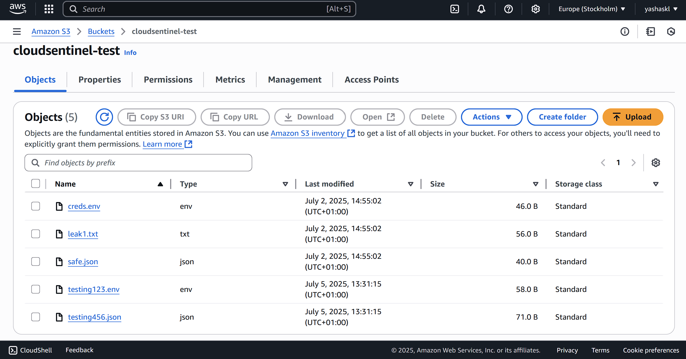

# CloudSentinel – Cloud Storage Leak Detection Dashboard



CloudSentinel is a **multi-cloud storage leak scanner** with an interactive **CustomTkinter GUI**.  
It scans **AWS S3** and **Azure Blob Storage** for sensitive data, encrypts detection logs, and provides real-time dashboards with powerful analysis tools.

---

## 🚀 Features

- **Multi-Cloud Support** – Scan both AWS S3 buckets and Azure Blob containers.
- **Real-time Leak Dashboard** – Shows leak files, types, and masked values instantly.
- **Encrypted Logging** – Stores leak values in `encrypted_logs.csv` using AES encryption.
- **On-Demand Decryption** – “Decrypt All Logs” popup to reveal actual leak values with your encryption key.
- **File Decay Tracking** – Tracks *first seen*, *last modified*, and *file age* in days.
- **Developer Fingerprinting** – Attempts to identify which developer introduced the leak.
- **Leak Fingerprinting** – Generates unique IDs for each leak to avoid duplicate tracking.
- **Cross-Cloud View** – View AWS and Azure leaks in one interface.
- **Offline GUI Mode** – Review encrypted logs without live scanning.
- **Unique Advantage Over Enterprise Tools**  
  🔹 Enterprise cloud security tools like **Azure Defender** and **Amazon Macie** focus on classification and policy enforcement.  
  **CloudSentinel** adds **developer attribution**, **file decay tracking**, and **cross-cloud leak analysis** — features typically missing from enterprise-grade offerings.

---

## 📦 Installation

### 1️⃣ Clone the repository
```bash
git clone https://github.com/YOUR_USERNAME/CloudSentinel.git
cd CloudSentinel
2️⃣ Create a virtual environment
bash
Copy
Edit
python -m venv venv
source venv/bin/activate   # On Linux/Mac
venv\Scripts\activate      # On Windows
3️⃣ Install dependencies
bash
Copy
Edit
pip install -r requirements.txt
🔑 Configuration
Create a .env file in the root folder:

env
Copy
Edit
# AWS credentials
AWS_ACCESS_KEY_ID=your_aws_access_key
AWS_SECRET_ACCESS_KEY=your_aws_secret_key
AWS_REGION=your_region

# Azure credentials
AZURE_STORAGE_ACCOUNT_NAME=your_storage_account
AZURE_STORAGE_ACCOUNT_KEY=your_account_key
▶️ Running CloudSentinel
bash
Copy
Edit
python gui/main_gui.py
📷 Screenshots
1. Dashboard – Azure Leak Scan

Real-time detection from Azure Blob Storage.

2. Decrypt All Logs – Full Leak View

Enter your AES key to reveal all stored leaks.

3. AWS Leak Scan

Scanning AWS S3 bucket for leaked .env, .json, .txt files.

4. Empty Dashboard

No leaks detected yet.

5. Azure Blob Storage – Test Container

Container: cloudsentinel-test with .env and .json files.

6. AWS S3 – Test Bucket

Bucket: cloudsentinel-test with multiple test files.

🖥 Usage Flow
Select Provider → AWS or Azure.

Enter Bucket/Container name.

Click Start Scan.

View results in the Leak Detection Dashboard.

Click on any file → Analysis Panel shows:

Leak Type

Developer

First Seen

Last Modified

File Age

Encrypted Leak Log

To view actual values → Click Decrypt All Logs and enter your encryption key.

🛠 Development
Folder structure:

bash
Copy
Edit
CloudSentinel/
│
├── gui/
│   ├── main_gui.py           # Main GUI entry point
│   ├── decrypt_popup.py      # Decryption popup window
│
├── scanners/
│   ├── aws_scanner.py        # AWS S3 scanning logic
│   ├── azure_scanner.py      # Azure Blob scanning logic
│
├── utils/
│   ├── dev_fingerprint.py    # Developer identity tracking
│   ├── decay_log.py          # File decay tracking
│
├── reports/
│   ├── formatter.py          # Report formatting & encryption
│
├── requirements.txt
├── .env
💡 Unique Features vs Enterprise Tools
Feature	Azure Defender	AWS Macie	CloudSentinel
Sensitive Data Detection	✅	✅	✅
Cross-Cloud Scanning	❌	❌	✅
Developer Attribution	❌	❌	✅
File Decay Tracking	❌	❌	✅
AES-Encrypted Leak Logs	❌	❌	✅
Offline Review of Logs	❌	❌	✅

⚠️ Disclaimer
CloudSentinel is for educational and authorized security testing only.
Do NOT use it on systems you do not own or have permission to test.
